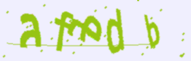
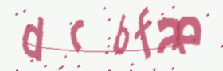

# Captcha Maker

## What is the Captcha Maker Project?

This project is part of my portfolio and continuous learning journey. It includes the source code for a CAPTCHA maker
designed to create image-based CAPTCHAs using the first six letters of the alphabet.

## Prerequisites

- Python 3.11 or higher
- Library `captcha` (install with `pip install captcha`)

## Legal Disclaimer

Please note that this scraper is intended for educational and research purposes. Users are responsible for using this
software in compliance with all applicable laws. The author of this project cannot be held responsible for any misuse.

## Downloading the project

- Clone the repository using the command `git clone https://github.com/santannaflaercio/captcha-maker.git`

## Usage

- To run the project, execute the command `python main.py` in the project's root directory.

## Examples

The following images are examples of CAPTCHAs generated by the project:

Example 1:

Example 2:

Example 3:

