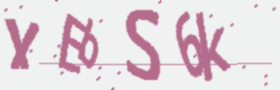
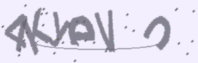
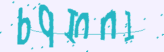

# Captcha Maker

This repository contains a simple CAPTCHA creator project. The project generates a random CAPTCHA image with 6
characters, including letters and numbers.


## How to Run

To run the maker, simply run the `generator.py` script in Python. For further costumization, you can change the values
of the variables in the `generator.py` file.

```python
number_of_captchas = 10  # Number of captcha images to be generated
number_of_characters = 6  # Number of characters in the captcha
```

## Expected Output

The following images are examples of CAPTCHAs generated by the project:

### Example 1



### Example 2



### Example 3



## How to Contribute

Contributions are always welcome! Here's how you can get involved:

- Report any bugs or issues you encounter.
- Suggest new features or enhancements to improve the captcha maker.
- Submit pull requests with code improvements or fixes.

We appreciate your contributions and feedback to make this project better!

## License

This project is released without a license. You are free to use it for any purpose.

**Happy Coding!**
